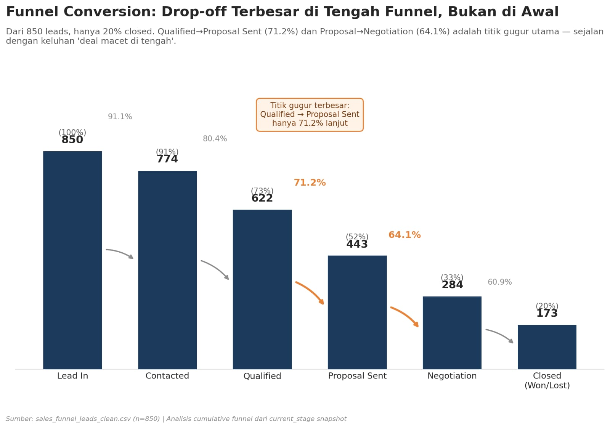
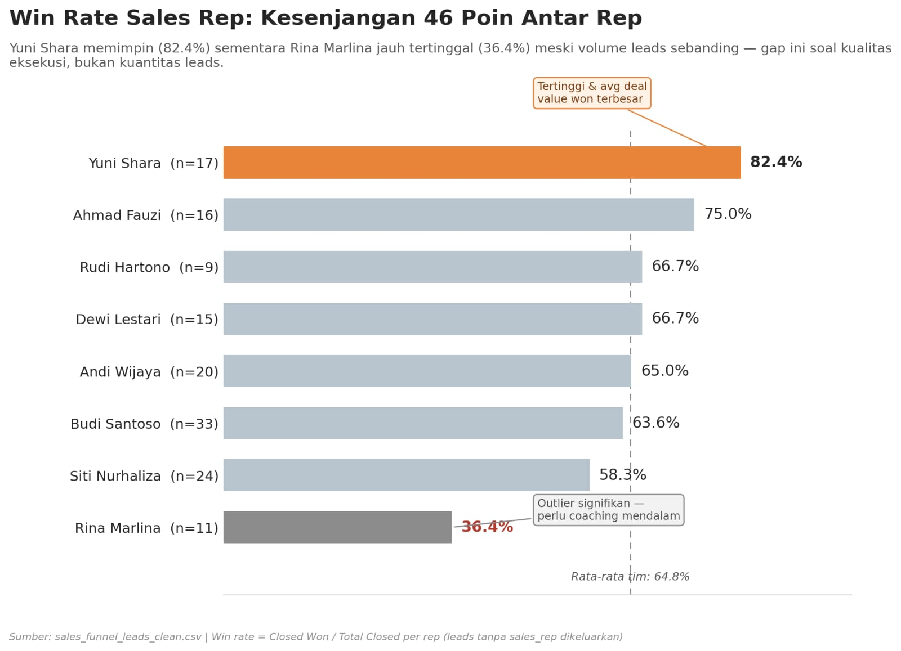
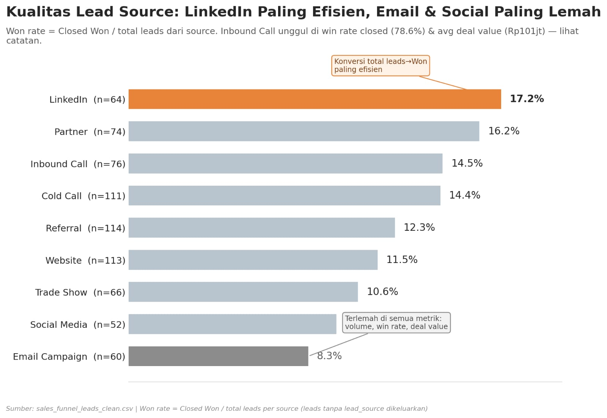
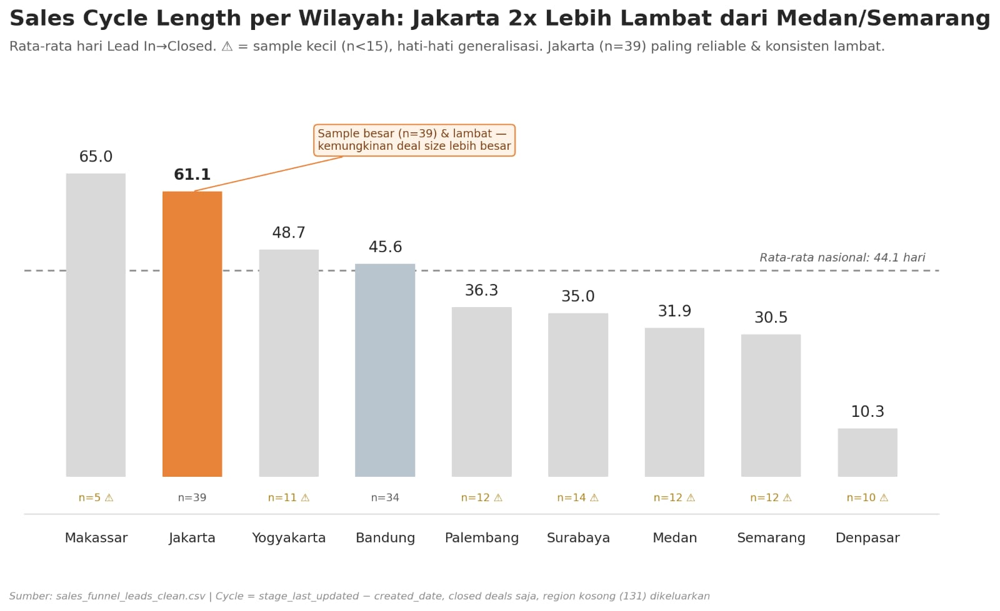
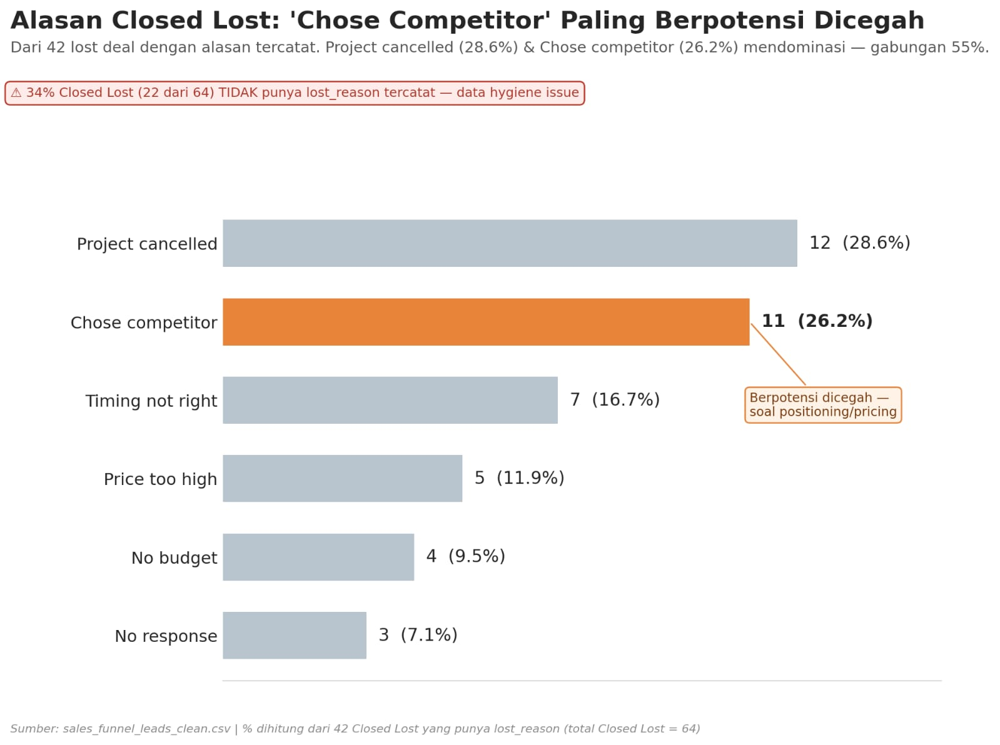

# Sales Funnel Performance Analysis

> A data-driven analysis of a B2B sales pipeline (850 leads) — uncovering where deals stall, how sales reps perform, which lead sources deliver the most value, how sales cycles vary by region, and why deals are lost. Includes actionable recommendations for sales leadership.

---

## 📋 Table of Contents

- [Overview](#-overview)
- [Key Performance Indicators](#-key-performance-indicators)
- [1. Funnel Conversion](#1-where-are-leads-dropping-off)
- [2. Win Rate per Sales Rep](#2-how-does-each-sales-rep-perform)
- [3. Lead Source Quality](#3-which-lead-source-is-most-valuable)
- [4. Sales Cycle Length by Region](#4-how-long-does-the-sales-cycle-take-per-region)
- [5. Lost Reason Breakdown](#5-why-are-deals-lost-and-can-it-be-prevented)
- [Priority Recommendations Roadmap](#-priority-recommendations-roadmap)
- [Data Notes & Limitations](#-data-notes--limitations)
- [Repository Structure](#-repository-structure)

---

## 📊 Overview

This project analyzes a sales funnel dataset (`sales_funnel_leads_clean.csv`, 850 rows) covering leads from multiple sources, sales reps, and regions. The goal is to answer five core business questions for sales leadership:

1. Where in the funnel do leads drop off the most?
2. Which sales reps are over- or under-performing, and why?
3. Which lead sources deliver the highest quality leads?
4. How does sales cycle length vary across regions?
5. Why are deals lost, and how many are preventable?

The full narrative report (with executive framing, callouts, and recommendations) is available as a PDF: [`Laporan_Analisis_Sales_Funnel.pdf`](./Laporan_Analisis_Sales_Funnel.pdf). This README summarizes the same findings for quick reference on GitHub.

---

## 🎯 Key Performance Indicators

| KPI | Value | Note |
|---|---|---|
| **Total Leads** | 850 | Leads captured across all sources and reps |
| **Conversion Rate (Lead → Closed)** | 20% | Only 173 of 850 leads reached Closed (Won/Lost); 80% remain open in the pipeline |
| **Overall Win Rate** | 63% | 109 of 173 closed leads were Won — but varies sharply by rep (36%–82%) |
| **Average Sales Cycle** | 43 days | For Closed Won deals; ranges from 10 days (Denpasar) to 61 days (Jakarta) |

**Headline finding:** the pipeline looks large (850 leads), but only 20% actually close. Most of the friction happens in the **middle of the funnel** — not at the top — and performance gaps across reps, sources, and regions point to clear, fixable opportunities.

---

## 🛠️ Tools & Tech Stack

- **SQL** — extracting & aggregating campaign data from the database
- **Power BI** — dashboard visualization and cross-channel performance reporting
- **Claude AI** — used to accelerate project development and improve workflow efficiency
- **Data Visualization** — communicating insights to non-technical stakeholders

---

## 🔍 Key Findings

## 1. Where Are Leads Dropping Off?

**Key numbers**
- 🔻 **71.2%** conversion from Qualified → Proposal Sent (biggest drop-off)
- 🔻 **64.1%** conversion from Proposal Sent → Negotiation
- 🟠 **80% of leads (677)** are still active, with an average of 365–396 days since last update

**Insight:** The biggest drop-off happens in the *middle* of the funnel, not at the top (Contacted is still at 91%). This matches the common complaint that deals get "stuck in the middle." A large share of leads are also not being closed at all — they sit idle for close to a year, effectively rotting silently in the CRM.

**Business impact:** A pipeline that looks large on paper (850 leads) is misleading — only 20% actually close. The CRM is full of "zombie leads," which makes pipeline value and forecasts unreliable for decision-making.

**Recommendations**
- → Set a maximum stage-age SLA (30–45 days) for Qualified and Proposal Sent
- → Coach reps specifically on "moving proposal to negotiation"
- → Run a monthly audit of leads inactive for 90+ days

---

## 2. How Does Each Sales Rep Perform?

**Key numbers**
- 🔺 **82.4%** — highest win rate (Yuni Shara)
- 🔻 **36.4%** — lowest win rate (Rina Marlina)
- ↔ **46-point gap** between the highest and lowest performer

**Insight:** The performance gap isn't about lead volume — Rina handled a comparable number of leads (75) to other reps but still lags far behind. Rudi Hartono is the most disciplined at follow-up (only 5.9% of leads never contacted) and it shows in his results. Andi Wijaya and Budi Santoso handle the highest lead volume but only post medium win rates — a possible sign of overload.

**Business impact:** Uneven performance across the team means results depend heavily on individual reps rather than a repeatable, coachable process.

**Recommendations**
- → Deep 1-on-1 coaching for Rina Marlina
- → Turn Rudi Hartono and Yuni Shara into mentors; document their playbook as team SOP
- → Redistribute leads away from Andi Wijaya and Budi Santoso to reduce overload

---

## 3. Which Lead Source Is Most Valuable?

**Key numbers**
- 🔺 **17.2%** — highest won rate (LinkedIn)
- 🔻 **8.3%** — lowest won rate (Email Campaign)
- 💰 **Rp 101M** — highest average deal value, plus 78.6% win rate among closed deals (Inbound Call)

**Insight:** LinkedIn converts total leads into Won deals most efficiently. Inbound Call stands out on quality — highest win rate among closed deals and the highest average deal value — likely because inbound leads already carry strong intent. Email Campaign and Social Media underperform on nearly every metric: volume, win rate, and deal value.

**Business impact:** Marketing budget and effort spent on Email Campaign and Social Media is likely inefficient compared to other channels, and may be diverting resources from higher-value channels.

**Recommendations**
- → Reallocate part of the budget from Email/Social to LinkedIn
- → Strengthen Referral and Partner programs (strong volume and deal value)
- → Prioritize fast response times for Inbound Call leads — intent is already high

---

## 4. How Long Does the Sales Cycle Take per Region?

**Key numbers**
- 🔺 **61.1 days** — Jakarta, the longest cycle with a reliable sample size (n=39)
- 🔵 **~31 days** — Medan / Semarang, the fastest regions with a solid sample size
- 🔻 **~2x longer** — Jakarta compared to the fastest regions

**Insight:** Jakarta (the largest and most reliable sample, n=39) is consistently almost twice as slow as Medan, Semarang, or Surabaya. Lost deals also tend to linger longer (48.9 days) before being closed, compared to Won deals (43.4 days).

**Business impact:** Applying a single national quota/target without accounting for this difference will bias forecasts, especially for Jakarta.

**Recommendations**
- → Adjust Jakarta's quota/targets to reflect its longer cycle
- → Investigate whether the delay is due to larger deal sizes or inefficient internal processes
- → Encourage reps to "fail fast" — close out dead deals sooner so effort can be redirected

> ⚠️ Regions with fewer than 15 closed deals (marked with ⚠ in the chart) should be interpreted with caution due to small sample size.

---

## 5. Why Are Deals Lost, and Can It Be Prevented?

**Key numbers**
- ⚠️ **34%** of lost deals (22 of 64) have **no reason recorded**
- 🟠 **26.2%** — "Chose competitor," the most preventable reason
- 💵 **21%** — combined "Price too high" + "No budget," which could be filtered out earlier

**Insight:** Among deals with a recorded reason, "Project Cancelled" (28.6%) and "Chose Competitor" (26.2%) dominate. "Chose competitor" is potentially preventable through better positioning or pricing, while the 34% of deals with no recorded reason represents a serious data hygiene gap that limits root-cause analysis.

**Business impact:** Roughly 26% of lost deals (lost to competitors) could potentially be saved with faster, more competitive responses, and 21% (budget-related) could be filtered out earlier instead of consuming sales effort in later stages.

**Recommendations**
- → Make `lost_reason` a required field before a deal can be marked Closed Lost
- → Strengthen the BANT qualifying checklist early in the funnel to filter out leads without budget
- → Run regular win-loss reviews for deals lost to competitors

---

## 🗺️ Priority Recommendations Roadmap

| Quick Wins (0–30 days) | Mid-term (1–3 months) | Long-term (3–6 months) |
|---|---|---|
| Require `lost_reason` before marking Closed Lost | Set a max stage-age SLA for Qualified & Proposal Sent | Strengthen BANT qualifying checklist at funnel entry |
| Audit all leads inactive 90+ days; require reps to update or close them | Redistribute leads from overloaded reps (Andi Wijaya, Budi Santoso) | Run regular win-loss reviews for competitor losses |
| Share best practices from Yuni Shara & Rudi Hartono with the team | Shift marketing budget from Email/Social to LinkedIn | Re-evaluate regional quotas based on actual cycle length (especially Jakarta) |
| | Intensive coaching for Rina Marlina | |

---

## 📎 Data Notes & Limitations

- **Region**: 15% missing — excluded from region-level analysis
- **Lead Source**: 14% missing — excluded from source-level analysis
- **Sales Rep**: 10% missing — excluded from rep-level analysis
- **Deal Value**: 29% missing — affects deal value analysis
- The dataset is a **snapshot of `current_stage`** per lead (not a full history log of every stage transition), so a cumulative funnel approach is used as the best available proxy — exact drop-off points cannot be mapped with 100% precision.
- Some regions have very small closed-deal sample sizes (n = 5–14) — generalize with caution.

---

## 👤 Author

Agi Agustian Davi - Entry Level Data Analyst

